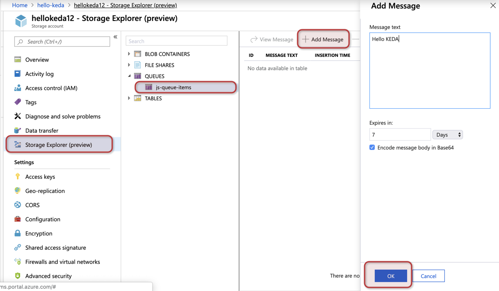

# KEDA and Azure Functions with queues sample

This sample goes through the basics of creating an Azure Function that triggers on a new Azure Storage Queue message.  The function can then be deployed to Kubernetes with KEDA for event driven activation and scale.

## Pre-requisites

* [Azure Function Core Tools v2](https://github.com/azure/azure-functions-core-tools#installing). Makes sure the version is greater than: 2.7.1149
* An Azure Subscription (to host the storage queue).  A free account works great - [https://azure.com/free](http://azure.com/free)
* Kubernetes cluster (can be [AKS](https://docs.microsoft.com/en-us/azure/aks/kubernetes-walkthrough-portal), GKE, EKS, OpenShift etc.) and [`kubectl`](https://kubernetes.io/docs/tasks/tools/install-kubectl/) pointing to your Kubernetes cluster (for [AKS](https://docs.microsoft.com/en-us/azure/aks/kubernetes-walkthrough#connect-to-the-cluster)).  NOTE: If you want to use KEDA with Azure Virtual Nodes, be sure to [enable Virtual Nodes](https://docs.microsoft.com/en-us/azure/aks/virtual-nodes-portal) at create.
* Docker and a Docker registry

## Tutorial

#### 1. Create a new directory for the function app

```cli
mkdir hello-keda
cd hello-keda
```

#### 2. Initialize the directory for functions

```cli
func init . --docker
```

Select **node** and **JavaScript**

#### 3. Add a new queue triggered function

```cli
func new
```

Select **Azure Queue Storage Trigger**

Leave the default of `QueueTrigger` for the name

#### 4. Create an Azure storage queue

We'll create a storage account and a queue named `js-queue-items`

You can use the [Azure CLI](https://docs.microsoft.com/cli/azure/install-azure-cli?view=azure-cli-latest), the [Azure cloud shell](https://shell.azure.com), or [the Azure portal](https://docs.microsoft.com/azure/storage/common/storage-quickstart-create-account#create-a-storage-account-1). The following is how you do it using Azure CLI.

`<storage-name>` would be replaced by a unique storage account name.

```cli
az group create -l westus -n hello-keda
az storage account create --sku Standard_LRS --location westus -g hello-keda -n <storage-name>

CONNECTION_STRING=$(az storage account show-connection-string --name <storage-name> --query connectionString)

az storage queue create -n js-queue-items --connection-string $CONNECTION_STRING
```

#### 5. Update the function metadata with the storage account info

Open the `hello-keda` directory in an editor.  We'll need to update the connection string info for the queue trigger, and make sure the queue trigger capabilities are installed.

Copy the current storage account connection string (HINT: don't include the `"`)

```cli
az storage account show-connection-string --name <storage-name> --query connectionString
```

Open `local.settings.json` which has the local debug connection string settings.  Replace the `{AzureWebJobsStorage}` with the connection string value:

**local.settings.json**
```json
{
  "IsEncrypted": false,
  "Values": {
    "FUNCTIONS_WORKER_RUNTIME": "node",
    "AzureWebJobsStorage": "DefaultEndpointsProtocol=https;EndpointSuffix=core.windows.net;AccountName=mystorageaccount;AccountKey=shhhh==="
  }
}
```

Finally, open the `QueueTrigger/function.json` file and set the `connection` setting value to `AzureWebJobsStorage`.  This tells the function to pull the connection string from the `AzureWebJobsStorage` key we set above.

**function.json**
```json
{
  "bindings": [
    {
      "name": "myQueueItem",
      "type": "queueTrigger",
      "direction": "in",
      "queueName": "js-queue-items",
      "connection": "AzureWebJobsStorage"
    }
  ]
}
```

#### 6. Enable the storage queue bundle on the function runtime

Replace the `host.json` content with the following.  This [pulls in the extensions to the function runtime](https://docs.microsoft.com/azure/azure-functions/functions-bindings-register#local-development-with-azure-functions-core-tools-and-extension-bundles) like Azure Storage Queues support.

**host.json**
```json
{
    "version": "2.0",
    "extensionBundle": {
        "id": "Microsoft.Azure.Functions.ExtensionBundle",
        "version": "[1.*, 2.0.0)"
    }
}
```

#### 7. Debug and test the function locally (optional)

Start the function locally
```cli
func start
```

Go to your Azure Storage account in the [Azure Portal](https://portal.azure.com) and open the **Storage Explorer**.  Select the `js-queue-items` queue and add a message to send to the function.



You should see your function running locally fired correctly immediately

```cli
[5/1/19 6:00:53 AM] Executing 'Functions.QueueTrigger' (Reason='New queue message detected on 'js-queue-items'.', Id=2beeca56-4c7a-4af9-b15a-86d896d55a92)
[5/1/19 6:00:53 AM] Trigger Details: MessageId: 60c80a55-e941-4f78-bb93-a1ef006c3dc5, DequeueCount: 1, InsertionTime: 5/1/19 6:00:53 AM +00:00
[5/1/19 6:00:53 AM] JavaScript queue trigger function processed work item Hello KEDA
[5/1/19 6:00:53 AM] Executed 'Functions.QueueTrigger' (Succeeded, Id=2beeca56-4c7a-4af9-b15a-86d896d55a92)
```

#### 8. Install KEDA

```cli
func kubernetes install --namespace keda
```
To confirm that KEDA has successfully installed you can run the following command and should see the following CRD.

```cli
kubectl get customresourcedefinition
NAME                        AGE
scaledobjects.keda.k8s.io   2h
```

#### 9a. Deploy Function App to KEDA (standard)

You can then deploy your function to Kubernetes.  If you want to deploy so that the function may run on Virtual Nodes, [follow 9b](#9b-deploy-function-app-to-keda-virtual-nodes)

```cli
func kubernetes deploy --name hello-keda --registry <docker-user-id>
```

This will build the docker container, push it to the specified registry, and deploy it to Kubernetes. You can see the actual generated deployment with the `--dry-run` flag.

#### 9b. Deploy Function App to KEDA (Virtual Nodes)

To deploy your function Kubernetes with Azure Virtual Nodes, you need to modify the details of the deployment to allow the selection of virtual nodes.

Generate a deployment yaml for the function.
```cli
func kubernetes deploy --name hello-keda --registry <docker-user-id> --javascript --dry-run > deploy.yaml
```

Open and modify the created `deploy.yaml` to tolerate scheduling onto any nodes, including virtual.

```yaml
spec:
      containers:
      - name: hello-keda
        image: <your-docker-registry>/hello-keda
        env:
        - name: AzureFunctionsJobHost__functions__0
          value: QueueTrigger
        envFrom:
        - secretRef:
            name: hello-keda
      tolerations:
      - operator: Exists
```

Apply the deployment to deploy the function app.
```cli
kubectl apply -f deploy.yaml
```

#### 10. Add a queue message and validate the function app scales with KEDA

Initially after deploy and with an empty queue you should see 0 pods.

```cli
kubectl get deploy
```

Add a queue message to the queue (using the Storage Explorer shown in step 7 above).  KEDA will detect the event and add a pod.  By default the polling interval set is 30 seconds on the `ScaledObject` resource, so it may take up to 30 seconds for the queue message to be detected and activate your function.  This can be [adjusted on the `ScaledObject` resource](https://github.com/kedacore/keda/wiki/ScaledObject-spec).

```cli
kubectl get pods -w
```

The queue message will be consumed.  You can validate the message was consumed by using `kubectl logs` on the activated pod.  New queue messages will be consumed and if enough queue messages are added the function will autoscale.  After all messages are consumed and the cooldown period has elapsed (default 300 seconds), the last pod should scale back down to zero.

## Cleaning up resources

#### Delete the function deployment

```cli
kubectl delete deploy hello-keda
kubectl delete ScaledObject hello-keda
kubectl delete Secret hello-keda
```

#### Delete the storage account

```cli
az storage account delete --name <storage-name>
```

#### Uninstall KEDA

```cli
func kubernetes remove --namespace keda
```
